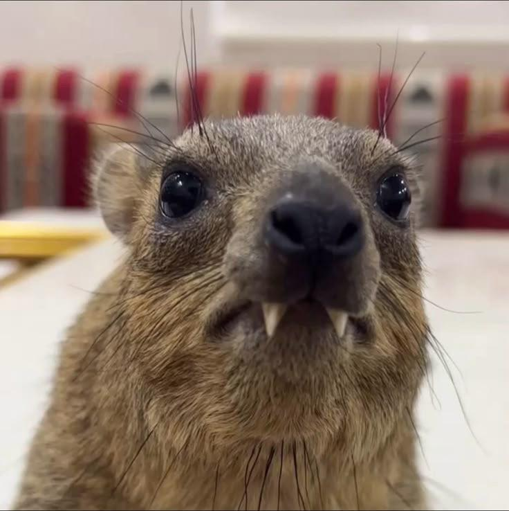
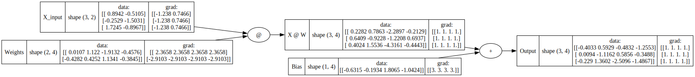
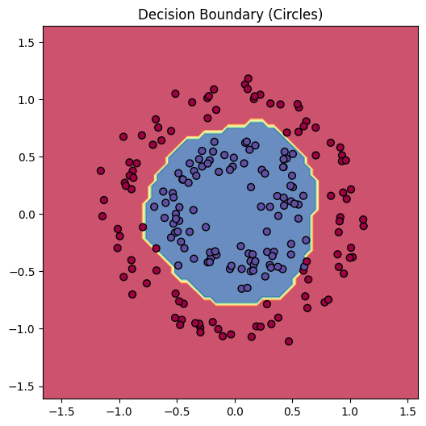
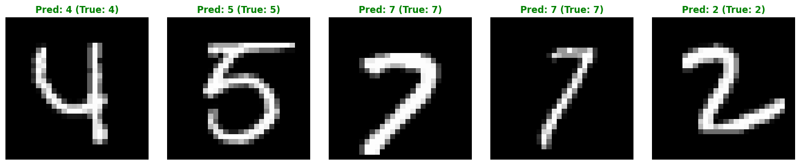

# tensorgrad



I spent some time following Andrej Karpathy's micrograd tutorial and decided to take it a step further. So, I challenged myself to see if I could build a fully vectorized version. You can check out `autograd_from_scratch_yay.ipynb` to see the step-by-step construction of tensorgrad.

### example usage
below is an example showing a number of possible supported operations, demonstrating matrix calculation, broadcasting, and activation functions:

```python
import numpy as np
from tensorgrad.engine import Tensor
from tensorgrad.utils import draw_tensor

# initialize tensors with data
x = Tensor(np.random.randn(3, 4), label='x')
w = Tensor(np.random.randn(4, 5), label='w')
b = Tensor(np.random.randn(1, 5), label='b')

# build a mathematical expression
out = (x @ w + b).relu()
loss = out.sum()

# compute gradients across the entire graph automatically
loss.backward()

print(w.grad) # prints the exact gradients matching PyTorch!

# we can also visualize the computation graph
draw_tensor(out, show_data=True)
```
The computation graph of the math expression above can be seen on the image below:


### training a neural network
A full demo of training the Vectorized Multi-Layer Perceptrons (MLPs) can be seen in `demo.ipynb`. The first section demonstrates building an 2 layer neural network to solve non-linear binary classification tasks on the make_circles dataset. By implementing an SVM "max-margin" loss, the network cleanly separates the spatial data.



The notebook then shows the model performance classifying handwritten digits from the MNIST dataset. Using Kaiming Initialization and a mathematically fused Softmax + Cross-Entropy loss, the engine processes batches of thousands of 784-dimensional images to achieve 90%+ accuracy.



